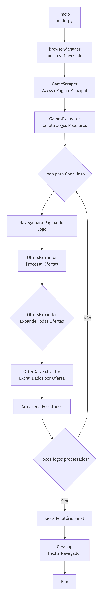
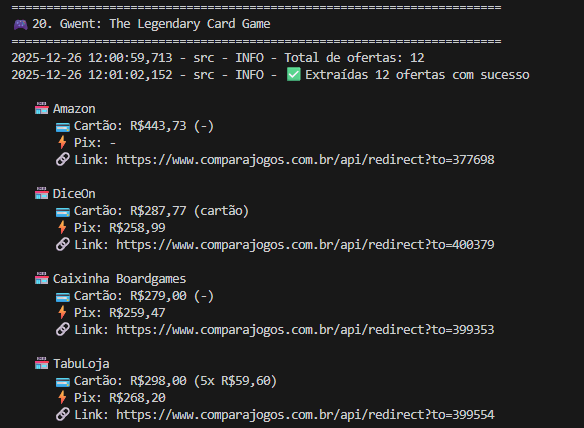

# 🎮 GameDeals Scraper


Um scraper para extração automatizada de ofertas de jogos de tabuleiro do site ComparaJogos.com.br que permite coletar dados de preços, lojas, formas de pagamento e links diretos para as melhores ofertas do mercado.


## Sobre o projeto
Acompanhar manualmente preços de jogos em múltiplas lojas é um processo demorado e propenso a erros. 
Desse modo, o Game_Deals Scraper foi desenvolvido para automatizar a coleta de informações sobre jogos de tabuleiro, oferecendo aos usuários uma visão completa das melhores ofertas disponíveis em diferentes lojas brasileiras apresentadas no site ComparaJogos.com.br. Para essa tarefa, a ferramenta Playwright foi estrategicamente escolhida por possuir suporte nativo a páginas altamente dinâmicas, API assíncrona, auto-wait Nativo que aguarda elementos antes de interações, e facilidade para lidar com cliques, scroll, botões e eventos JS. Além disso, o Playwright permite simular um usuário real, reduzindo falhas em páginas com carregamento progressivo de conteúdo. Portanto, o scraper transforma um processo manual e demorado em uma operação automatizada e eficiente.

## Instalação

Pré-requisitos: Python 3.12.1

#### 1.  Clonar o repositório
Abra o terminal do seu dispositivo e execute o seguinte comando:
```
git clone https://github.com/brendabo1/Game_deals.git
```
#### 2.  Instlar dependências
```
pip install -r requirements.txt
playwright install
```
#### 3. Executar o scraper
```
cd src
python main.py
```


## Objetivo 

O objetivo desse projeto é:

- Coletar os jogos populares da semana exibidos na página principal do site ComparaJogos.com.br
- Acessar a página individual de cada jogo
- Extrair todas as ofertas disponíveis, mesmo aquelas carregadas dinamicamente
- Coletar preços para:
  - Pagamento no cartão
  - Pagamento via Pix
  - Informações de parcelamento


## Principais Funcionalidades

✔ Extração dos jogos populares da semana  
✔ Navegação automática para páginas individuais de jogos, aguardaando o carregamento dinâmico com múltiplas estratégias
✔ Expansão dinâmica do botão “Mostrar mais” para carregar todas as ofertas  
✔ Coleta de preços para cartão e Pix  
✔ Tratamento de múltiplos formatos de exibição de preço  
✔ Tratamento de exceções e falhas de carregamento  
✔ Logging para acompanhamento do scraper  

<div align="center">
  <figure>  
    
    <figcaption>
      <p align="center"><b>Figura 1</b> - Fluxo de funcionamento do scraper </p>
    </figcaption>
  </figure>
</div>

<div align="center">
  <figure>  
    
    <figcaption>
      <p align="center"><b>Figura 2</b> - Saída esperada </p>
    </figcaption>
  </figure>
</div>

